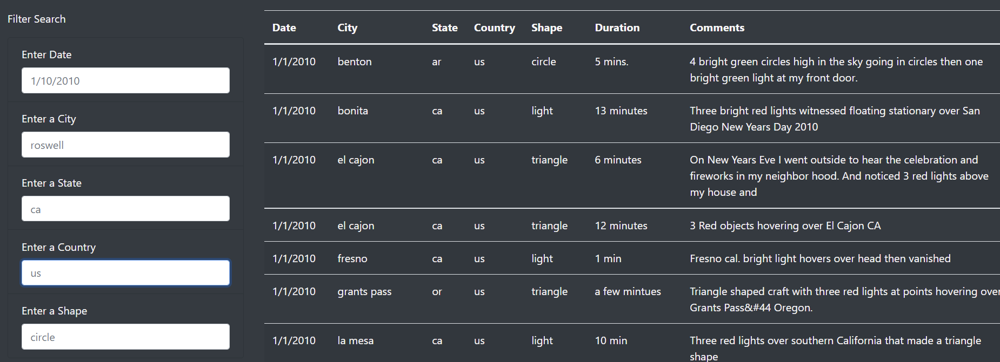
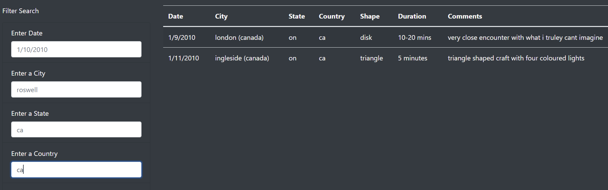
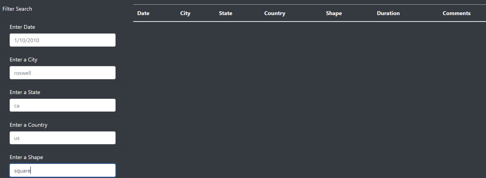

# UFOs

## Overview of Project: 

The aim of the project is to upgrade and provide a more in-depth analysis of UFO sightings by letting users to filter for multiple criteria at the same time. 
The following criterias will be added to the table filters: city, state, country and shape.

## Results

In the web page, we can see the table that shows all the information about UFO sightings, this table can be updated with the filter section on the left side, which includes the criterias for searching, such as date, city, state, country, shape.

The input white box for each criteria can be written at the same time, which allows a more specific filtering.

When some words or criteria do not exist in the data, the 
table will not shows anything but the headers will be still there.

## Summary

One drawback of this new design with multiple criteria is figuring out how to know speed up the search process without doing many trials.
A first recommendation for further development could be having a pop up box that displays the suggested options that should be in the data when the words are being written in the input box, which makes easier the searching process and avoid having an empty table.
As a second recommendation might be having a range of duration time that can be displayed as a criteria, which allows develops further objective information. 

